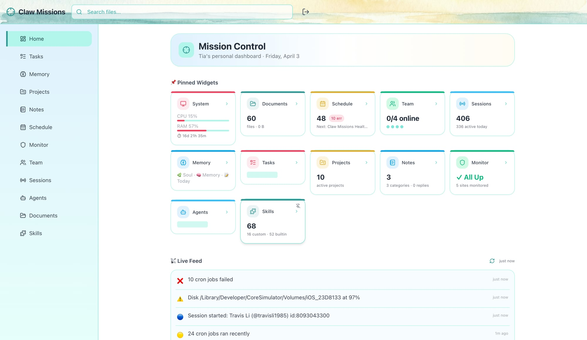
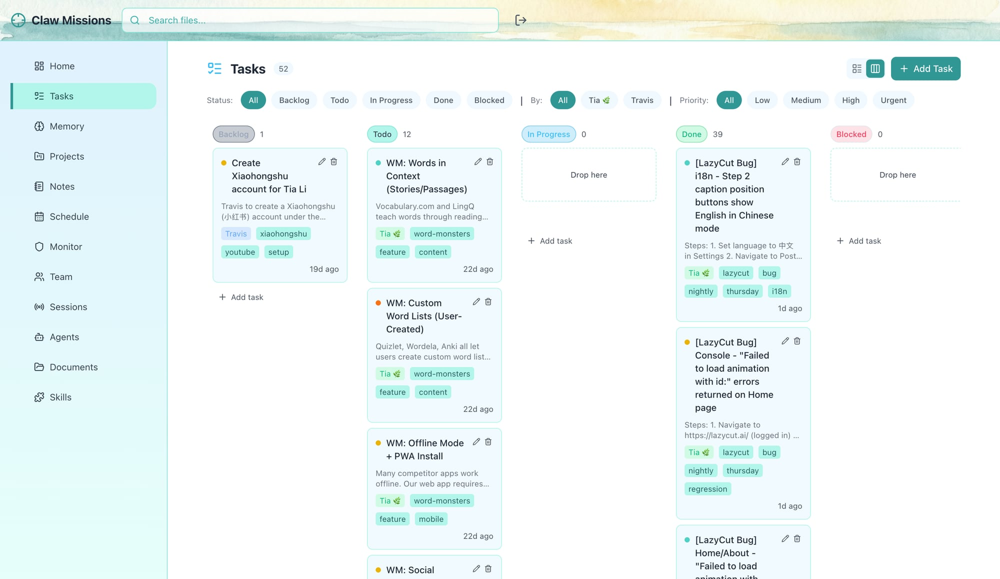
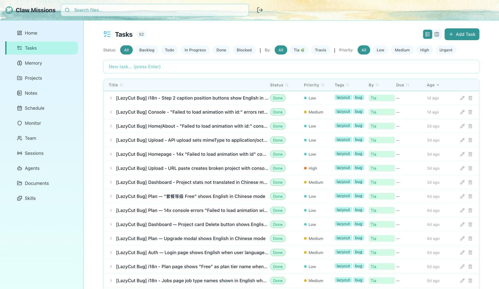
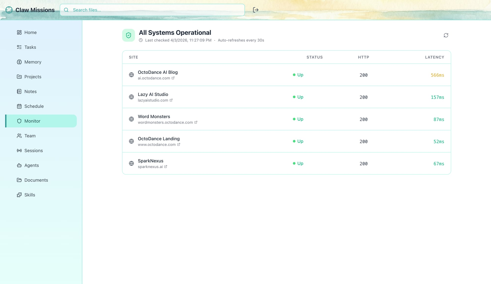
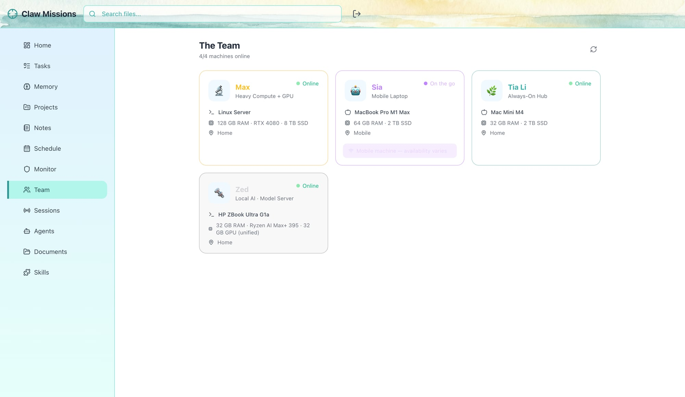
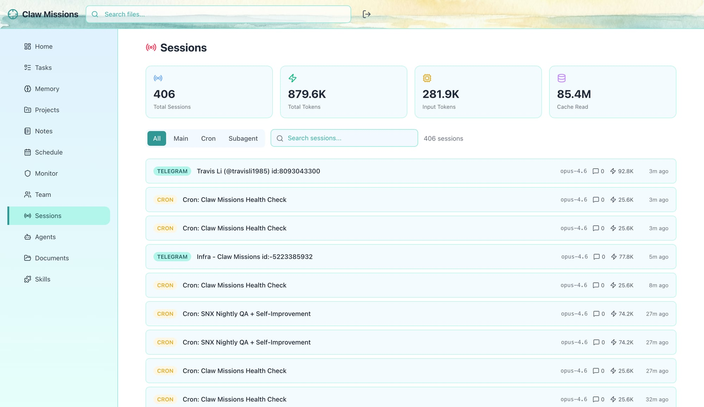
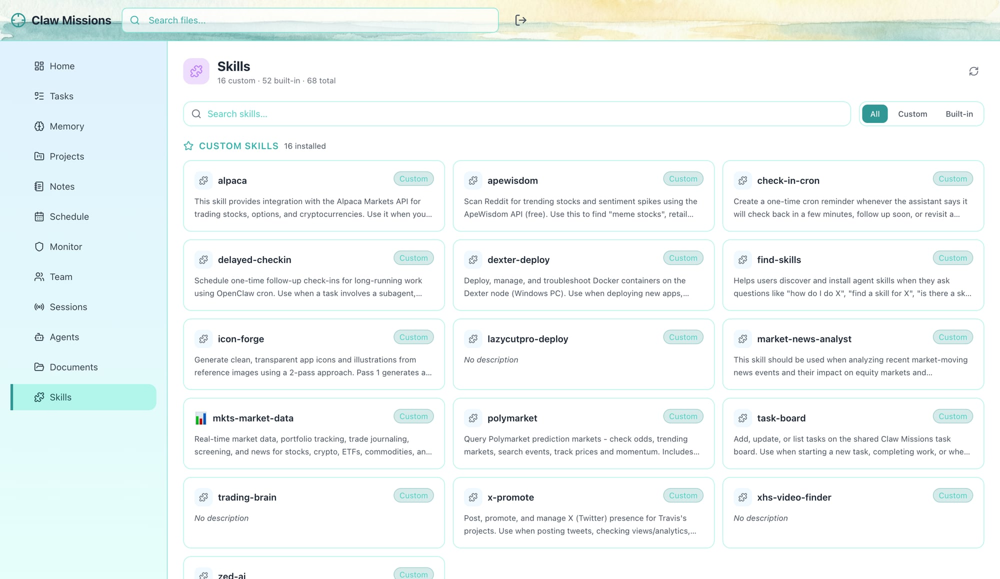
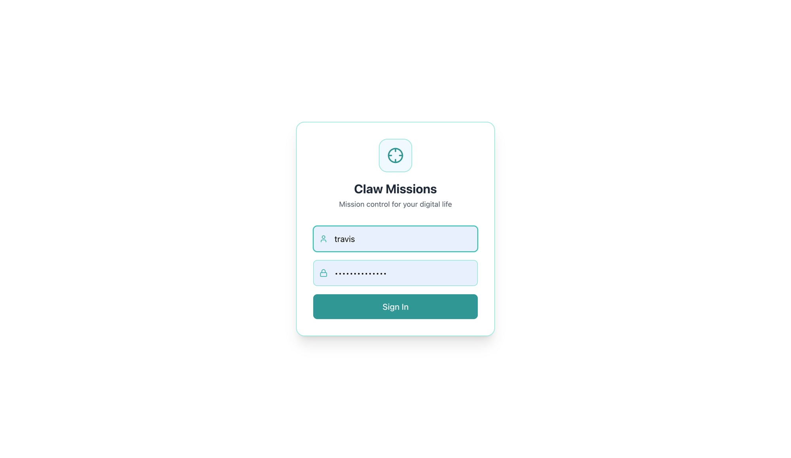

# Claw Missions

**Mission control for your digital life.** A self-hosted AI operations dashboard for file storage, task tracking, agent monitoring, and team visibility — built to be fast, private, and genuinely beautiful.

> Started as a personal file vault. Now a full AI ops hub.

[](./LICENSE)
[](https://fastapi.tiangolo.com)
[](https://react.dev)
[](https://tailwindcss.com)

---

## 📸 Screenshots

### 🏠 Mission Control — Home Dashboard


### ✅ Tasks — Kanban Board


### 📋 Tasks — Sortable List View


### 🌐 Monitor — Uptime & Latency


### 👥 Team — Multi-Machine Overview


### 📡 Sessions — AI Session History


### 🧠 Skills — Agent Skills Browser


### 🔐 Login


---

## What Is Claw Missions?

Claw Missions is a lightweight, self-hosted platform that gives you full ownership of your files, AI agents, and automation pipelines. No subscriptions, no third-party clouds, no bloat.

### Core Features

- 🏠 **Mission Control Dashboard** — Pinned widgets for system stats, uptime, tasks, projects, notes, team status, and AI sessions — all at a glance
- ✅ **Task Tracker** — Full kanban board + sortable list view with drag-and-drop, status filters, priority tiers, assignee tracking, and tags
- 📁 **File Vault** — Upload, tag, search, and preview files; supports images, PDFs, and arbitrary binaries up to 500 MB
- 🌐 **Site Monitor** — HTTP uptime checker for your self-hosted services with live latency display
- 👥 **Team View** — Multi-machine overview showing each device's hardware specs, role, and online status
- 📡 **Sessions Browser** — Full OpenClaw session history with token usage, model, type (main/cron/subagent), and search
- 🧠 **Skills Browser** — Browse and inspect all installed OpenClaw skills (custom + built-in), searchable and filterable
- 🗓️ **Schedule** — Cron job calendar view of your automation schedules
- 📝 **Notes & Memory** — Structured note-taking and AI memory file browser
- 🔎 **Global Search** — Search across files, notes, and projects from the header bar

### Design

- Ocean-themed UI — teal accent palette, watercolor header, clean white canvas
- Responsive sidebar navigation with 12 sections
- Light mode first — no forced dark mode
- Inline task quick-add ("type and hit Enter")
- Real-time live feed on the home dashboard

---

## Quick Start

### Local (Python + Node)

```bash
git clone https://github.com/travislius/claw-missions.git
cd claw-missions

# Backend
cp .env.example .env          # Edit with your settings
cd backend && pip install -r requirements.txt
uvicorn app.main:app --host 0.0.0.0 --port 5679

# Frontend (separate terminal)
cd frontend && npm install && npm run build
```

Frontend is served as static files by the FastAPI backend. Visit `http://localhost:5679`.

### Docker

```bash
cp .env.example .env          # Edit first
docker compose up -d
```

Runs at `http://localhost:5679`. Data persists in `./data/`.

---

## Configuration

```env
CLAWMISSIONS_USERNAME=admin
CLAWMISSIONS_PASSWORD=changeme
CLAWMISSIONS_SECRET=your-random-jwt-secret
CLAWMISSIONS_STORAGE=/path/to/files
CLAWMISSIONS_DB=/path/to/clawmissions.db
CLAWMISSIONS_MAX_UPLOAD_MB=500
CLAWMISSIONS_PORT=5679
CLAWMISSIONS_ALLOWED_ORIGINS=https://your.domain.com
```

---

## API

```bash
# Log in
TOKEN=$(curl -s -X POST http://localhost:5679/api/auth/login \
  -H "Content-Type: application/json" \
  -d '{"username":"admin","password":"changeme"}' | jq -r .access_token)

# Upload a file
curl -X POST http://localhost:5679/api/files/upload \
  -H "Authorization: Bearer $TOKEN" \
  -F "file=@/path/to/file.pdf"

# Search files
curl "http://localhost:5679/api/files/search?q=report" \
  -H "Authorization: Bearer $TOKEN"

# Machine-to-machine (API key)
curl http://localhost:5679/api/files \
  -H "X-API-Key: your-api-key"
```

Full interactive docs: `http://localhost:5679/docs` (Swagger UI)

---

## Tech Stack

| Layer | Tech |
|-------|------|
| Frontend | React 18 + Vite + Tailwind CSS |
| Backend | Python 3.14 + FastAPI + Uvicorn |
| Database | SQLite via SQLAlchemy |
| Auth | JWT (24h) + bcrypt + API key |
| Storage | Native filesystem |
| Container | Docker + docker-compose |

---

## Security

- Bcrypt password hashing
- JWT with configurable expiry
- CORS lockdown via `CLAWMISSIONS_ALLOWED_ORIGINS`
- API key auth for machine-to-machine calls
- `team.json` and `.env` are gitignored — no secrets in the repo

For production, add **Cloudflare Access** as a zero-trust auth layer (free tier covers personal deployments).

See [SECURITY.md](./SECURITY.md) for the full guide.

---

## Deployment

Designed for **Mac Mini / Linux home server** behind Cloudflare tunnel:

```
Mac Mini :5679 → cloudflared → missions.yourdomain.com
```

Works equally well on a Raspberry Pi, VPS, or any Linux box.

---

## Roadmap

- [ ] Multi-user support with role-based access
- [ ] Folder organization + nested projects
- [ ] Bulk file operations (tag, delete, move)
- [ ] Full-text search inside documents (PDF/txt)
- [ ] Share links (public file sharing with expiry)
- [ ] Mobile app (React Native or PWA)
- [ ] Calendar day/week view in Schedule tab

---

## Contributing

PRs welcome. Open an issue first for big changes.

---

## License

MIT — use it, fork it, make it yours.

---

Built by [@travislius](https://github.com/travislius)
